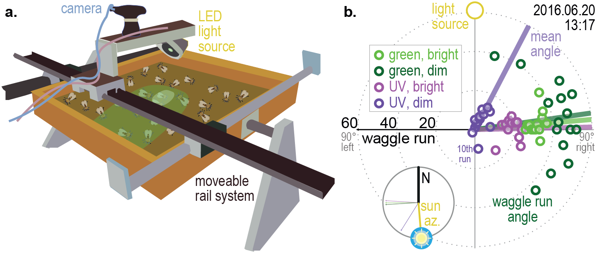

# High intensity overrides spectral cues in dancing honeybees
This repository contains files relevant to the manuscript "_High intensity overrides spectral cues in dancing honeybees_"
by James J. Foster, 	Jacob M. Graving and Keram Pfeiffer.
A project analysing the dances of honeybees
presented with green and UV light spots of different brightnesses. 

  

Raw waggle-run angles can be found in `colourdances.csv`. 
Data organisation and exploratory analysis performed in `R`, using the scripts 
`GUV_organisedata.R` and `GUV_analysis_summary.Rmd` and functions from `GUV_functions.R`.

Circular GLMMs fitted using methods from [unwrap](https://github.com/jgraving/unwrap) 
in `Python` as documented in `GUV_circGLMM_fit.ipynb`, 
visualised in `R` in `GUV_circGLMM_summary.RMD`.

Analysis summaries are provided as [`Analysis Summary.pdf`](2Results/Analysis_summary.pdf), 
[`Circular GLMM Fitting.pdf`](2Results/Circular_GLMM_Fitting.pdf) and [`Circular GLMM Summary.pdf`](2Results/Circular_GLMM_Summary.pdf).
